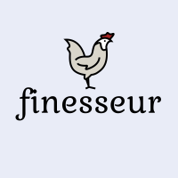

<!-- anchor -->

<!-- logo -->
 

    

<!-- title -->

 <h3 align="center">PDF Finesseur</h3>

 

<!-- available languages -->

README available in:
     
  

 

<!-- github badges -->

<!-- tagline or short introduction -->
 

  An attempt at creating an appplication that can perform some tasks on a PDF such as merging them or reorder the pages.
 

 

---

---

<!-- news / quick announcements -->

### In construction

---

---

<!-- summary -->
 

**TABLE OF CONTENT**

[**🌱&nbsp; About the project**](#philosophy) | [**👨‍💻&nbsp; Tech stack**](#tech) |
[**📖&nbsp; Usage**](#usage) |
[**🎯&nbsp; Features**](#features) |
[**⚠️&nbsp; Limitations**](#limits) |
[**🤝&nbsp; Contributions**](#contribs) |
[**📘&nbsp; License**](#license) |
[**❤️&nbsp; Acknowledgments**](#acknowledgments) |
[**👀&nbsp; What else ?**](#encore)

# <a id="philosophy">🌱&nbsp;</a> About the project

For a more complex project, I need to implement authentification/authorisation. Therefore, I decided to do it in its own project and from scratch ( as much as possible ) so that I can understand all the concepts.

<!-- back to top -->

 

# <a id="tech">👨‍💻&nbsp;</a> Tech stack

- MongoDB / Mongoose
- Express
- React
- Typescript

<!-- back to top -->

 

# <a id="usage">📖&nbsp;</a> Usage

 

## 🚀&nbsp; Getting started

There is a folder named `server` which concerns the backend using Express.
The folder named `client` is the frontend implemented in React.

Each folder has a `package.json` file however a global `package.json` can be found at the root to start the application.

Here are some available scripts:

- `npm start`: run the app in the development mode. Open [http://localhost:3000](http://localhost:3000) to view it in your browser.
- `npm test`: lauch whatever test runner that has been used.
- `npm run build`: builds the app for production.

## ⚙️&nbsp; Requirements

- [Zustand](https://github.com/pmndrs/zustand) is used for the global state managment ( so easier than redux ).
- [Chakra UI](https://chakra-ui.com/) is an amazing component library to build beautiful React apps.
- [Mongoose](https://mongoosejs.com/), the documentation is so good.

## 👀&nbsp; Examples

In preparation.

<!-- back to top -->

 

# <a id="features">🎯&nbsp;</a> Features

- [ ]
- [ ]
- [ ]
- [ ]
  - [x]
  - [x]

<!-- back to top -->

 

# <a id="limits">⚠️&nbsp;</a> Limitations

### `npm run build`

I need to check if the build can be minified and the filenames include the hashes.

<!-- back to top -->

 

# <a id="contribs">🤝&nbsp;</a> Contributions

**Thanks in advance for anyone who will contribute to expanding this template!**

😱 Found a bug? Missing a specific feature?

If you have any suggestion, please proceed by forking this repo and creating a pull request or opening an issue with the tag `enhancement`.

🤩 Don't forget to give the project a star! Thanks again!

<!-- back to the top -->

 

# <a id="license">📘&nbsp;</a> License

This project is released under the terms of the [MIT License](LICENSE).

<!-- back to the top -->

 

# <a id="acknowledgments">❤️&nbsp;</a> Acknowledgments

🏆 Here are the nominees, with no particular order, in the category for **_best resources used for this project_**:

### front end

- [How to create forms with Chakra UI in React apps](https://blog.logrocket.com/how-to-create-forms-with-chakra-ui-in-react-apps/): very detailed article

- [Add a Color Mode to a Chakra-based app](https://dev.to/carwack/the-one-with-chakra-ui-vue-and-color-palette-switching-68e)

- [Use of HTTP cookie in React](https://blog.logrocket.com/how-to-secure-react-app-login-authentication/)

- [usehooks](https://usehooks.com/), a useful website of handful react hooks

- [i18n with i18next](https://dev.to/adrai/how-to-properly-internationalize-a-react-application-using-i18next-3hdb)

---

### back end

- [Express with example](https://www.freecodecamp.org/news/express-explained-with-examples-installation-routing-middleware-and-more/)

- [Example of authentification with Mongo and Express](https://www.bezkoder.com/node-js-mongodb-auth-jwt/)

- [Mongoose's style Guide](https://github.com/Zwimber/mongoose-style-guide)

- [Use of HTTP cookie in Express](https://medium.com/@zahedialfurquan20/using-cookies-to-store-jwt-for-authentication-and-authorization-in-a-mern-stack-app-a58d7a5d6b6e)

- [Clean code for Express app](https://www.codepedia.org/ama/cleaner-code-in-expressjs-rest-api-with-custom-error-handling)

- [Usage of Mongooose and Typescript 1](https://www.dailydeveloping.com/posts/Use-mongoose-with-typescript)
- [Usage of Mongooose and Typescript 2](https://medium.com/swlh/using-typescript-with-mongodb-393caf7adfef)
- [Usage of Mongooose and Typescript 3](https://medium.com/weekly-webtips/make-typescript-and-mongoose-play-nicely-together-3d3c94a91e34)

---

- [webpack for ts project](https://www.carlrippon.com/creating-react-app-with-typescript-eslint-with-webpack5/)

-[HOC and typescript](https://isamatov.com/react-hoc-typescript/) -[progress already done](https://www.kevinqi.com/react-circular-progressbar/) -[refs in react component](https://dev.to/carlosrafael22/using-refs-in-react-functional-components-part-2-forwardref-useimperativehandle-3naa) -[webpack and css module](https://blog.jakoblind.no/css-modules-webpack/)

### other

- [Usage of jsconfig.json](https://saurabhshah23.medium.com/react-app-with-absolute-paths-using-jsconfig-json-2b07b1cb24d4)

- [Nested value in object](https://dev.to/rajnishkatharotiya/select-a-nested-value-from-the-object-in-javascript-2fjd)

- [object Object and {}](https://stackoverflow.com/questions/49464634/difference-between-object-and-object-in-typescript)

- [styling buttons](https://ishadeed.com/article/styling-the-good-old-button/)

  <!-- back to the top -->
  

   
  

# <a id="encore">👀&nbsp;</a> What else ?

Thanks again for reading this README !!!

<!-- back to the top -->

 

